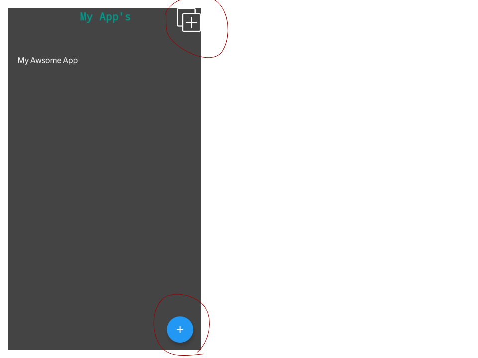
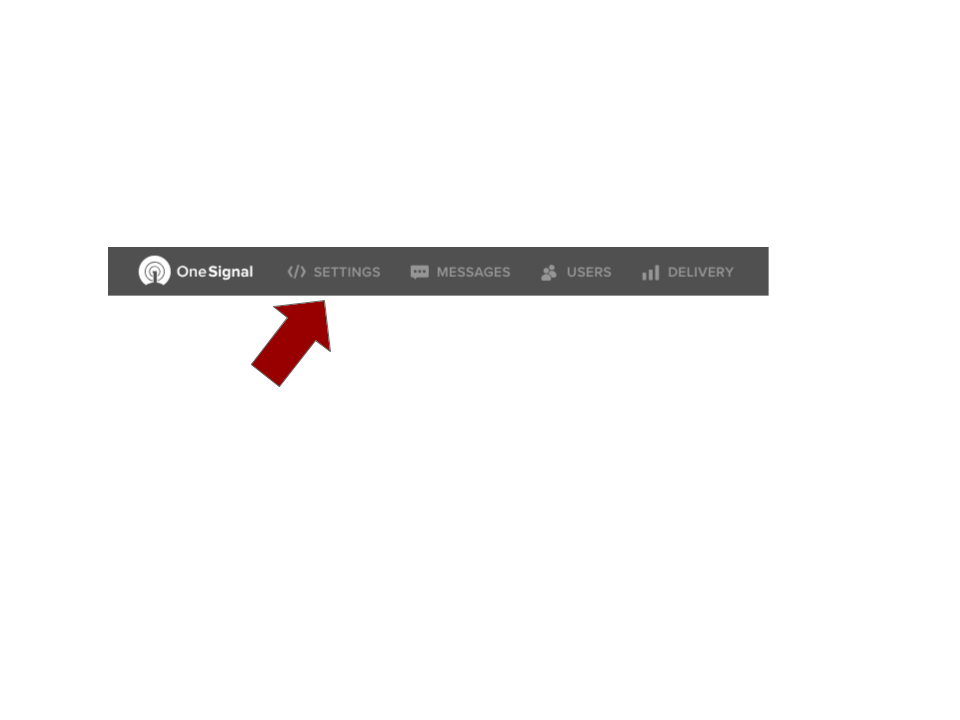
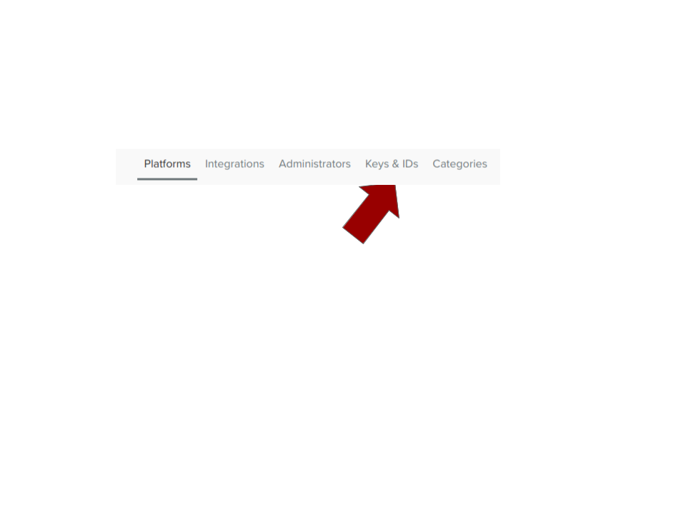
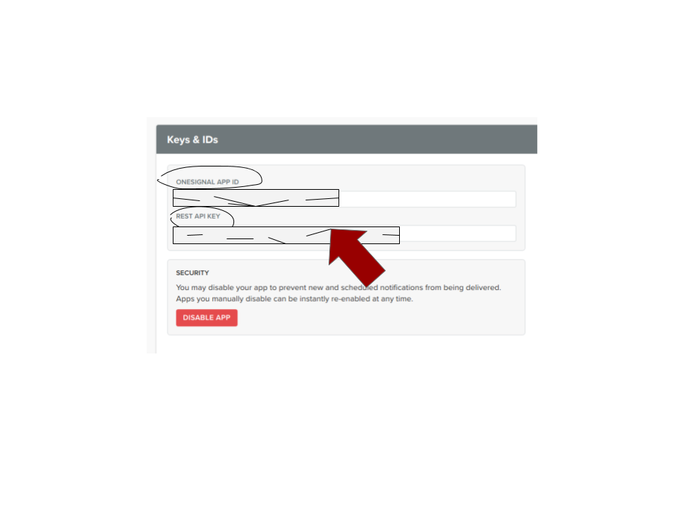

## One Signal Notification Sender

Send Push Notifications To Your One Signal Apps & Websites Right From Your Phone!

### Setup

The Setup Process Takes Only About 2 Minutes And You Are Then Up And Running!

## Step 1

Click On The Plus Symbol In The Top Right Corner Or The Floating Action Button In The Bottom Right Corner.

 

## Go to <a href="https://onesignal.com" target="blank">https://onesignal.com</a>

## Log In

## Click On The Application You Want To Send Push's To

## Then Click On Settings.

## Go To 'Keys & ID's'

## Copy And Paste The Following Values:

## And You're Done!

## Contact

Email: <a href="mailto:contact.gevosoft@gmail.com">contact.gevosoft@gmail.com</a>
